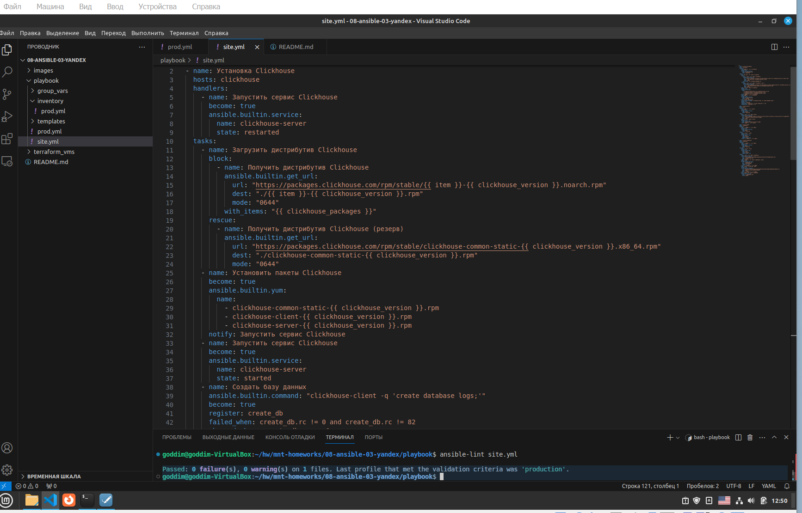
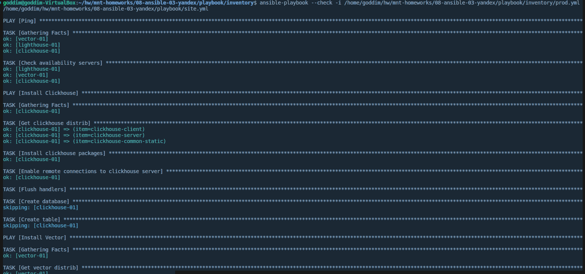
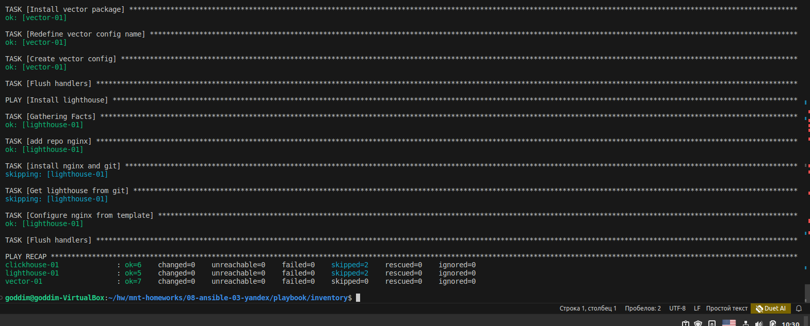
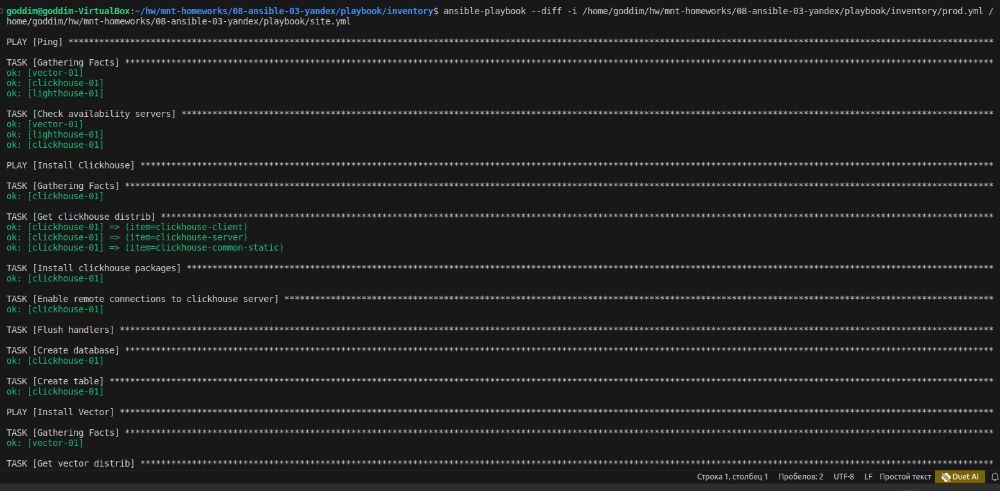
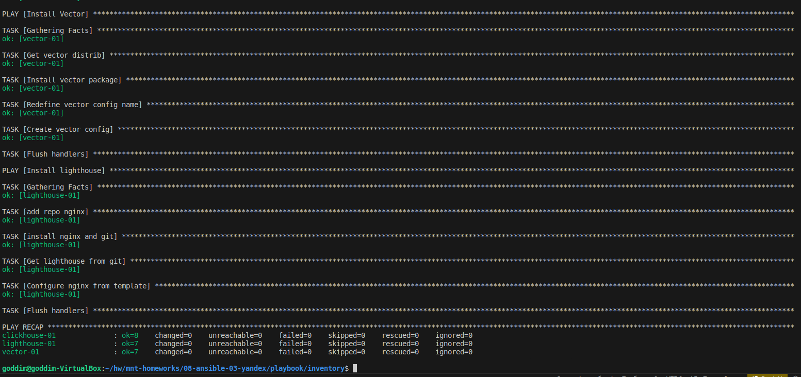
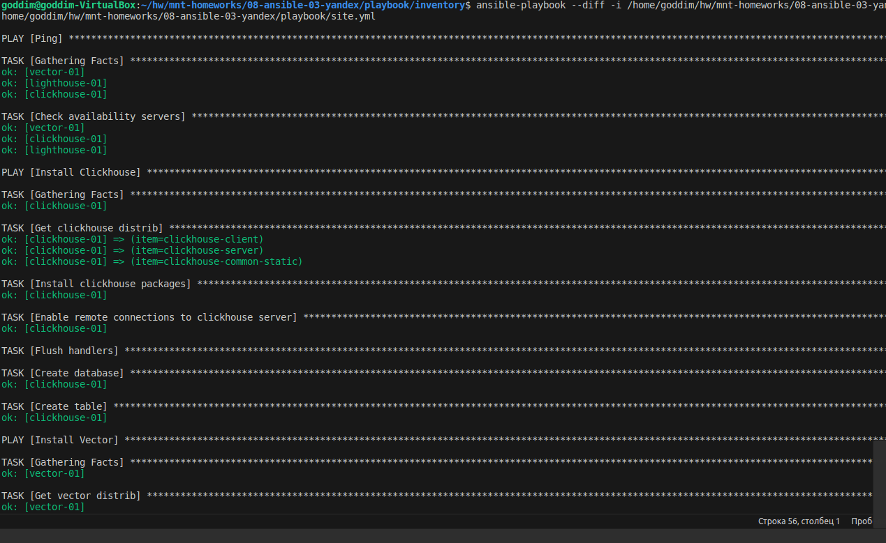
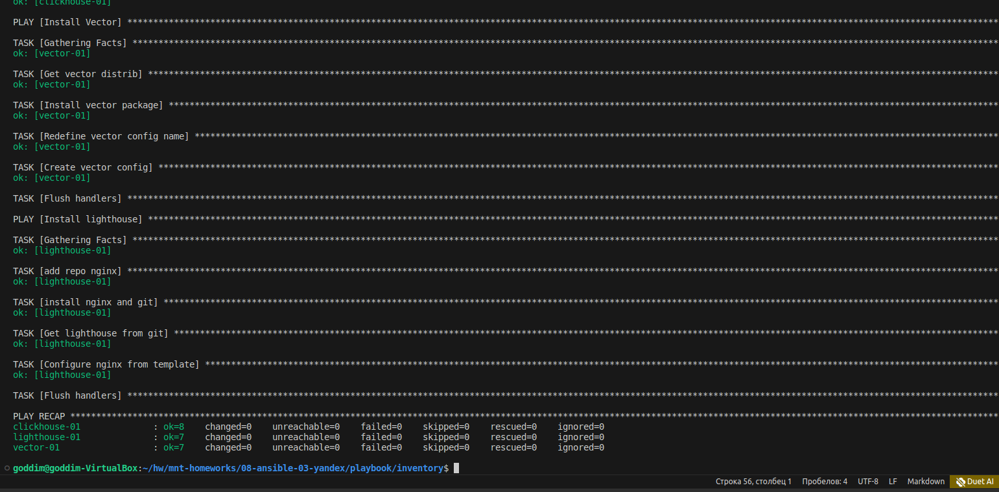

# Домашнее задание к занятию 3 «Использование Ansible»

## Подготовка к выполнению

1. Подготовьте в Yandex Cloud три хоста: для `clickhouse`, для `vector` и для `lighthouse`.
2. Репозиторий LightHouse находится [по ссылке](https://github.com/VKCOM/lighthouse).

## Основная часть

1. Допишите playbook: нужно сделать ещё один play, который устанавливает и настраивает LightHouse.
2. При создании tasks рекомендую использовать модули: `get_url`, `template`, `yum`, `apt`.
3. Tasks должны: скачать статику LightHouse, установить Nginx или любой другой веб-сервер, настроить его конфиг для открытия LightHouse, запустить веб-сервер.
4. Подготовьте свой inventory-файл `prod.yml`.
5. Запустите `ansible-lint site.yml` и исправьте ошибки, если они есть.

6. Попробуйте запустить playbook на этом окружении с флагом `--check`.

7. Запустите playbook на `prod.yml` окружении с флагом `--diff`. Убедитесь, что изменения на системе произведены.

8. Повторно запустите playbook с флагом `--diff` и убедитесь, что playbook идемпотентен.

9. Подготовьте README.md-файл по своему playbook. В нём должно быть описано: что делает playbook, какие у него есть параметры и теги.
### Playbook

   Playbook производит установку и настройку приложений для сбора, передачи и отображения логов на стэк серверов `clickhouse`, `vector` и `lighthouse`. Первый play объединяет последовательность задач по инсталяции Clickhouse. Блоку соответствует тэг `clickhouse`. Второй play объединяет последовательность задач по инсталяции Vector. Блоку соответствует тэг `vector`. Третий play объединяет последовательность задач по инсталяции Lighthouse. Блоку соответствует тэг `lighthouse`.

## Variables

   Значения переменных устанавливаются в файлах `vars.yml` в соответствующих директориях в `group_vars`. При помощи `vars.yml` задаются следующие параметры:
- `clickhouse_version`, `vector_version` - версии устанавливаемых приложений;
- `clickhouse_database_name` - имя базы данных в `clickhouse`;
- `clickhouse_create_table_name` - имя таблицы в `clickhouse`;
- `vector_config` - содержимое конфигурационного файла для приложения `vector`;
- `lighthouse_home_dir` - домашняя директория `lighthouse`;
- `nginx_config_dir` - директория расположения конфига `nginx`.

## Tags

Тэг `ping` - проверяет доступность серверов `clickhouse-01`,`vector-01`,`lighthouse-01`;
тэг `clickhouse` - позволяет производить отдельную настройку приложения `clickhouse`;
тэг `vector` - позволяет производить отдельную настройку приложения `vector`;
тэг `vector_config` - позволяет производить изменение в конфиге приложения `vector`;
тэг `lighthouse` - позволяет производить отдельную настройку приложения `lighthouse` на одноименных серверах.

10. Готовый playbook выложите в свой репозиторий, поставьте тег `08-ansible-03-yandex` на фиксирующий коммит, в ответ предоставьте ссылку на него.

---

### Как оформить решение задания

Выполненное домашнее задание пришлите в виде ссылки на .md-файл в вашем репозитории.

---
